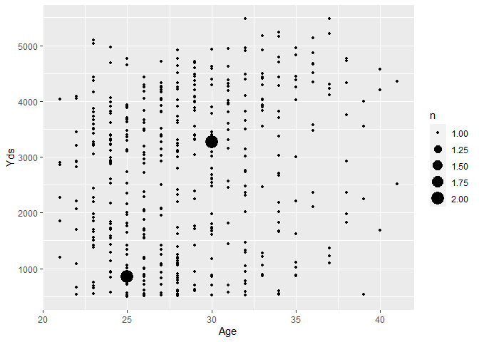
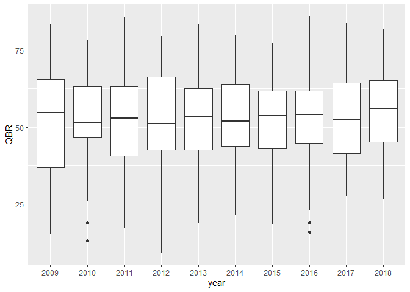
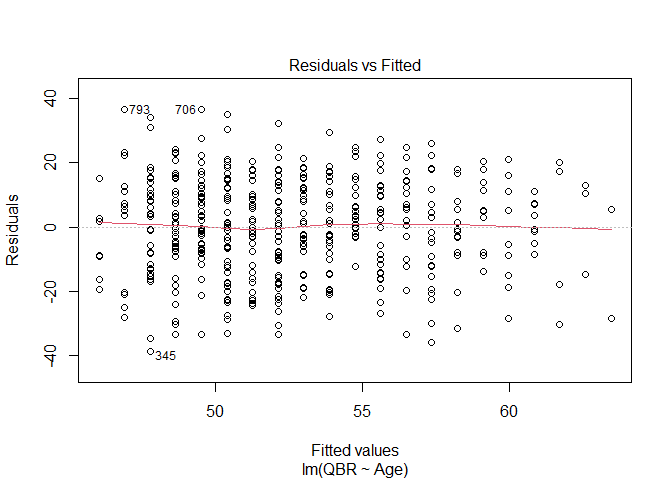
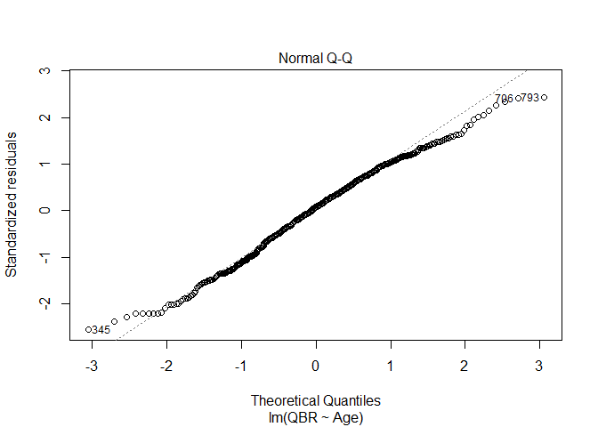
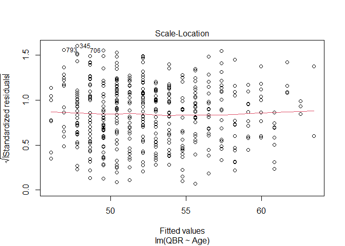
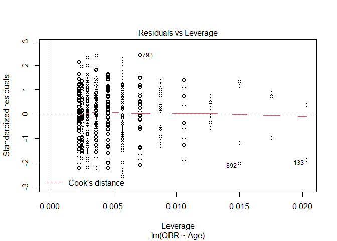

    library(dplyr)

    ## Warning: package 'dplyr' was built under R
    ## version 4.1.3

    ## 
    ## Attaching package: 'dplyr'

    ## The following objects are masked from 'package:stats':
    ## 
    ##     filter, lag

    ## The following objects are masked from 'package:base':
    ## 
    ##     intersect, setdiff, setequal,
    ##     union

    library(ggplot2)

    ## Warning: package 'ggplot2' was built under R
    ## version 4.1.3

We are going to look at multiple NFL Passing Data set from the year
2010-2018. They are all separate data sets so we can look into an
individual year. I wanted to see if we see the trend for passing yards
go up over time and see if their were any specific person responsible. I
also wanted to try and combine multiple data sets into one on R Studio.
I want to explore the data using R functions we learned in class. I also
want to look at regression using examples form class.

This is how I loaded the data sets into R using read.csv

    NFLSeason10 <- read.csv('C:/Users/hmoob/Documents\\pass-2010.csv')
    NFLSeason11 <- read.csv('C:/Users/hmoob/Documents\\pass-2011.csv')
    NFLSeason12 <- read.csv('C:/Users/hmoob/Documents\\pass-2012.csv')
    NFLSeason13 <- read.csv('C:/Users/hmoob/Documents\\pass-2013.csv')
    NFLSeason14 <- read.csv('C:/Users/hmoob/Documents\\pass-2014.csv')
    NFLSeason15 <- read.csv('C:/Users/hmoob/Documents\\pass-2015.csv')
    NFLSeason16 <- read.csv('C:/Users/hmoob/Documents\\pass-2016.csv')
    NFLSeason17 <- read.csv('C:/Users/hmoob/Documents\\pass-2017.csv')
    NFLSeason18 <- read.csv('C:/Users/hmoob/Documents\\pass-2018.csv')

We then combine the data sets. Here is where I had to omit the most
recent year because for some reason it had one fewer variables than the
other sets of data. However, I realized this data set did not already
have a column for year.

    NFL_All <- rbind(NFLSeason17, NFLSeason16, NFLSeason15, NFLSeason14, NFLSeason13, NFLSeason12, NFLSeason11, NFLSeason10)

I searched the internet and this is what I found that would help me. It
reads the file name from the path the folder I setup in my directory and
generates the year using the mutate and substr function.

    list_files <- list.files("C:/Users/hmoob/Documents/archive (5)", full.names = TRUE)
    NFLData <- lapply(list_files, function(fname) {
        NFL_All <- read.csv(fname, header = TRUE, stringsAsFactors = FALSE) %>%
            mutate(year = substr(basename(fname), 6, 9))
    }) %>% bind_rows()

    names(NFLData)

    ##  [1] "Rk"     "Player" "Tm"     "Age"   
    ##  [5] "Pos"    "G"      "GS"     "QBrec" 
    ##  [9] "Cmp"    "Att"    "Cmp."   "Yds"   
    ## [13] "TD"     "TD."    "Int"    "Int."  
    ## [17] "Lng"    "Y.A"    "AY.A"   "Y.C"   
    ## [21] "Y.G"    "Rate"   "QBR"    "Sk"    
    ## [25] "Yds.1"  "NY.A"   "ANY.A"  "Sk."   
    ## [29] "X4QC"   "GWD"    "year"

Changing string variable to Factor to try and plot them but then I
realized it was not a good visualization since it was hard to fit the
all the names on a single graph.

    NFLSeason18$Player <- as.factor(NFLSeason18$Player)

    class(NFLSeason18$Player)

    ## [1] "factor"

Here we use a few functions we did in class to better visualize and
understand the data set. Every Year in the NFL there is a few other
positions who attempt throws and I did not want their data so took
action in that as well.  
Ultimately I had to eliminate low outliers so I used subset to restrict
a minimum of 500 yards.

    NFLData500<- subset(NFLData, NFLData$Yds > 500)

    mean(NFLData500$Yds)

    ## [1] 2713.007

As I was looking for different visualizations this one stood out to me
as it didn’t need color and was able to highlight what a regular plot
graph isn’t able to. This plot does show why the “Prime” of a
Quarterback can be considered 30 years old, hitting 3000+ yards is not
easy. As there is a biggest dot there is good evidence in proving that
theory. Although not exactly a distribution curve i thought this
visualization did a good job as well.

    ggplot(NFLData500, aes(x = Age, y = Yds))+
      geom_count()

      labs(title = "QBR over the years with box plot", x = "year", y = "Yards")

    ## $x
    ## [1] "year"
    ## 
    ## $y
    ## [1] "Yards"
    ## 
    ## $title
    ## [1] "QBR over the years with box plot"
    ## 
    ## attr(,"class")
    ## [1] "labels"

    ggplot(NFLData500, aes(x = year, y = QBR))+
      geom_boxplot()

    ## Warning: Removed 11 rows containing non-finite
    ## values (stat_boxplot).

      labs(title = "QBR over the years with box plot", x = "year", y = "QBR")

    ## $x
    ## [1] "year"
    ## 
    ## $y
    ## [1] "QBR"
    ## 
    ## $title
    ## [1] "QBR over the years with box plot"
    ## 
    ## attr(,"class")
    ## [1] "labels"

When comparing QBR and Age, to see if players regress as they get older,
we can see no strong indication of this theory.

    m1 <- lm(QBR ~ Age, data = NFLData500)

    summary(m1)

    ## 
    ## Call:
    ## lm(formula = QBR ~ Age, data = NFLData500)
    ## 
    ## Residuals:
    ##     Min      1Q  Median      3Q     Max 
    ## -38.608 -10.084   1.184  11.308  36.660 
    ## 
    ## Coefficients:
    ##             Estimate Std. Error t value
    ## (Intercept)  27.8453     4.6854   5.943
    ## Age           0.8680     0.1624   5.344
    ##             Pr(>|t|)    
    ## (Intercept) 5.71e-09 ***
    ## Age         1.46e-07 ***
    ## ---
    ## Signif. codes:  
    ##   0 '***' 0.001 '**' 0.01 '*' 0.05 '.'
    ##   0.1 ' ' 1
    ## 
    ## Residual standard error: 15.12 on 439 degrees of freedom
    ##   (11 observations deleted due to missingness)
    ## Multiple R-squared:  0.06108,    Adjusted R-squared:  0.05894 
    ## F-statistic: 28.56 on 1 and 439 DF,  p-value: 1.463e-07

    plot(m1)

Here calculate the correlation between Age and yards. It is very weak
relationship.

    cor(NFLData500$Age, NFLData500$Yds)

    ## [1] 0.2017558

R Markdown is wonderful. It feels like having a stat calculator on hand.
The visualization is very helpful. I feel that R markdown is can be a
really good Visualization software if given the time to learn them all.
I found so many things about visualization online that we did not cover
in class. I had a few problems with Github. But the one that costed me
the most was when I tried to delete a file on the website. It will no
longer let me commit or pull/push and I just started a new repository.
The help site helped at time but it was though to trouble shoot as I was
not sure with Github program was useful to troubleshoot with for R. In
conclusion, I was a little disappointed in not being able to categorize
the variable player names into what I wanted it to be. I was able to
look at other cool factors such as Age, QBR and yards. If, I had more
time, I would try to see if somehow I can combine all the player
variables into one, in example have Tom Brady as a variable and it would
span across all the years. I also would have to like to run more
calculations to explore other stats as well.
